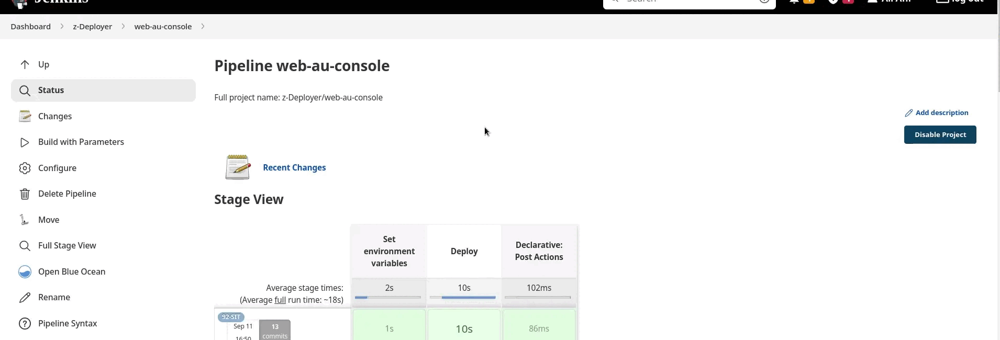

<!-- # database-compose -->

## About

A jenkins shared library that fetches docker image names and tags from a given registry by using docker registry API and returns the result as jenkins build parameters

Like this:


## How to Use

1. Add the library to jenkins [jenkins.io/doc](https://www.jenkins.io/doc/book/pipeline/shared-libraries/#automatic-shared-libraries)

2. Add docker credentials as a new global credential of **kind Username with password** to jenkins. (In my case the credential ID is `docker-credential`)
2. Load the library in you Jenkinsfile and call the `loadBuildParams` with three required **string** parameters (Image_Name, Repository_URL, Docker_Registry_Credential_ID)
    ```groovy
    @Library('jenkins-shared-library') _

    loadBuildParams('web-au-console', 'https://private-registry, 'docker-credential')
    ```

**NOTE**: To make this work with [docker hub](https://hub.docker.com), URL and parsing part should be changed
